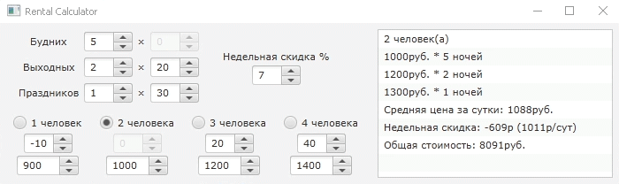

# Rental Calculator

Небольшое приложение позволяет удобно проводить
**подсчёты стоимости посуточной аренды** с учётом: 
* количества дней проживания
* типа дня (будние, выходные, праздники)
* недельной скидки
* количества гостей

Также **вычисляется изменение цен** в % по отношению
к цене в сутки по умолчанию (за двоих).
Введённые **данные сохраняются** в файл `settings.json` в том же каталоге.
При запуске эти данные автоматически подставляются.



### Быстрый запуск
Последнюю версию можно скачать
на [странице релизов](https://github.com/qwonix/rental-calculator/releases).

### Загрузка исходников
```shell
git clone https://github.com/qwonix/rental-calculator.git
cd rental-calculator
mvn package
java -jar ./target/RentalCalculator-{version}-shaded.jar
```